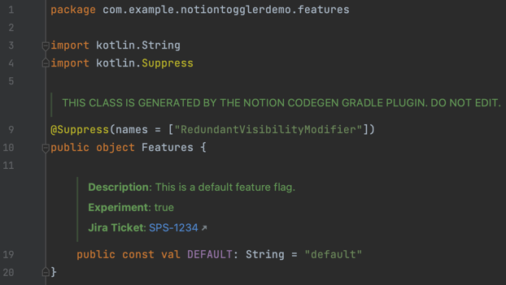

# Notion Feature Toggler
> Notion Feature Toggler is a lightweight, customizable, and completely free tool for managing feature flags in your application. It is based on the powerful Notion API, making it easy to manage which features are available in your app.

## Why? 
Why not? All feature toggle providers on the market come with **a cost** and **lack customization** options. They **rely on unreliable "strings"** of names for accessing features, and doesn't really provide any in-code information. Notion Feature Toggler kills these issues, providing a flexible, free, and intuitive way to manage and access feature flags.

## Core features
### Full customization of the FeatureFlag model
You can easily customize the `FeatureFlag` model to fit your needs and use this information in your code. For example, you can add a new property to the Notion Database to let everyone know that a new feature may break production, or add a new Person type column to differentiate Feature Flags by who is responsible for them.

### Completely free
Unlike other feature toggle providers, the Notion Feature Toggler has no cost at all because it uses the Notion API, which has [no limits](https://developers.notion.com/reference/request-limits) on the number of requests per time period. If you're developing a startup and using Notion for documentation, this is the easiest and most cost-effective way to manage your features.

### Spring Boot and Micronaut starters
The Notion Feature Toggler comes with pre-built integrations for Spring Boot and Micronaut, so you don't have to worry about writing your own notion-toggler-client. Just add the dependency and start using it.

### Customizable features refresh-rate
With the Notion Feature Toggler, you have full control over the interval at which the list of features is updated. This allows you to avoid the common problem of not knowing whether a feature is up-to-date or not, and how long to wait for it to be updated. However, please keep in mind the rate limiters of the Notion API, which is 3 seconds.

### Gradle plugin
The standard Notion Feature Toggler SDK relies on strings for accessing features, which can be error-prone and hard to maintain. The Gradle Plugin for generating constants over existing Feature Flags makes the system more robust and easier to maintain, and allows you to view information about your features directly in your code.

## Usage

1. First, you need to create a new integration in Notion to get an Integration API Token:
    - Go to [my-integrations](https://www.notion.so/my-integrations) page;
    - Give your integration a name (we recommend using the "-toggler" postfix to avoid confusion);
    - Choose the workspace where you want to store your Feature Flag database;
    - Give your integration the **Read Content Capability** permission. Notion Toggler only reads your database, no write-operations needed;
    - Click the Submit button and copy your **Internal Integration Token**.
2. Next, you need to create a database and connect it to your integration:
    - You can duplicate the following database in your Notion workspace: https://industrious-wool-c90.notion.site/Features-548bf64714564bad892132c75515336e;
    - Click the three dots in the top-right corner of the database page, and select "Add Connection". Choose the integration you created in step 1;
    - Optional: If you haven't connected Notion Toggler to your code yet, you can add new properties to your database as needed. For example, you might want to create a new column to store commands for your Feature Toggles.
3. Import Notion Toggler into your project:
    - Spring Boot Starter dependency:
        ```kotlin
        implementation("com.github.notion-toggler:notion-toggler-spring-boot-starter:1.0.0")
        ```
    - Micronaut dependency:
         ```kotlin
        implementation("com.github.notion-toggler:notion-toggler-micronaut:1.0.0")
        ```
    - If you're using a different framework, you can use the core library and implement your own integration:
        ```kotlin
        implementation("com.github.notion-toggler:notion-toggler-core:1.0.0")
        ```
4. Optional: If you created your own custom FF model for your database, you need to duplicate the new properties in your code and inherit from the FeatureFlag base model:
    - TODO: Attach the Kotlin and Notion type mapping table
5. Fill in the application properties:
    - The mandatory properties are:
        ```yaml
        notion.toggler.database-name=#the name of your new-brand database
        notion.toggler.token=#your Notion Integration Token
        ```

    - The optional properties are:
        ```yaml
        notion.toggler.refresh-interval=#value in seconds, must be > 3. Default: 30
        notion.toggler.model-path=#path to your custom FF model, like: io.yahorbarkouski.notion.toggler.spring.CustomFeatureFlag
        ```
6. Inject FeatureToggler start using it:
   ```kotlin
   @Inject
   private val featureToggler: FeatureToggler
     
   fun doSomething() { 
      if (featureToggler.isEnabled("my-feature")) {
           // do something
      }
   }
   ```

## Samples
TODO

## How does it work?
TODO

## Gradle Plugin
> Gradle plugin for Notion Feature Toggles code generation


### Reason
1. Increase the reliability of feature toggles, the default Notion Toggler SDK rely on strings to identify the feature toggles, which is error-prone and hard to maintain.
2. See description, tags, and other meta information directly in the code, which improves the readability of feature toggles in general.
3. It's hard to maintain stale features once using pure Strings, this plugin will help to find out the stale features and remove them from the codebase.

### Notes
1. This plugin is not a replacement for the Notion Toggler SDK, it is a code generation tool that generates the Notion SDK code for you.
2. This plugin generates git-tracked sources, so the generation doesn't block developers that does not create new notion features and doesn't want to export their Notion Tokens.
3. It's suggested to use notion-toggler together with ktlint gradle plugins (like [kotlinter](https://github.com/jeremymailen/kotlinter-gradle) or [ktlint-gradle](https://github.com/JLLeitschuh/ktlint-gradle)), to keep the generated code clean and readable. Example configuration:
    ```kotlin
   tasks.named("generateFeatures") {
       finalizedBy("formatKotlin")
   }
   ```
4. By default, this plugin will generate additional documentation for **description** basic FeatureToggle field, but you could also mark you own custom fields as documented for your futures, by annotating them as `io.yahorbarkouski.notion.toggler.core.annotation.Documented` annotation.

### Installation
You need to add the following lines to your `build.gradle.kts` file:
```kotlin
plugins { 
  id("io.yahorbarkouski.notion.toggler") version "<latest version from the Gradle plugin portal>"
}
```

### Gradle Task
#### Usage
```bash
gradle generateFeatures
```
#### Plugin Extension properties
| Property       | Default           | Type          | Description                                                               | Required |
|----------------|-------------------|---------------|---------------------------------------------------------------------------|---------|
| `token`        | `null`            | String        | Notion API Client Token | *       |
| `packageName`  |               | String?       | Package name for the generated files                                      |         |
| `databaseName` | `null`            | String        | Notion database name                                                      | *       |
| `modelPath`    | `null`            | String        | Fully-qualified class name of the feature flag model class                | *       |


#### Description
This task will generate a `$fileName.kt` file in the `$packageName` directory of your project. This file will contain all the feature toggles defined in your Notion database.

#### Extension example
```kotlin
notionToggler { 
   token = System.getenv("NOTION_TOKEN")
   packageName = "io.yahorbarkouski.chat.notion.constants"
   databaseName = "Features"
   modelPath = "io.yahorbarkouski.chat.notion.model.FeatureFlag"
}
```
#### Generated Features example


## Contribution
TODO